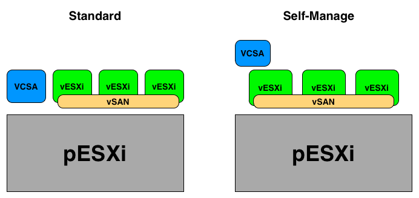
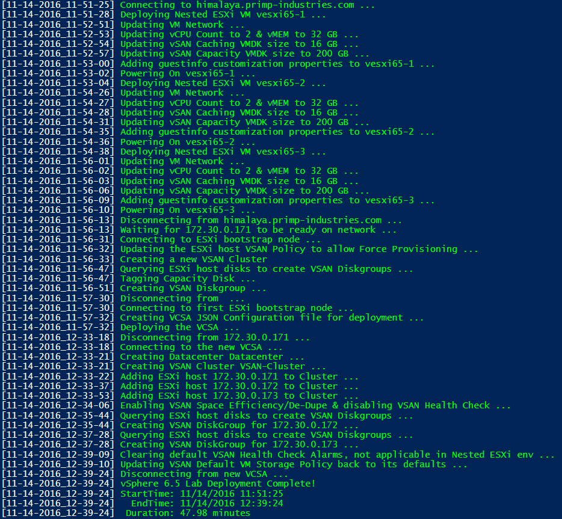
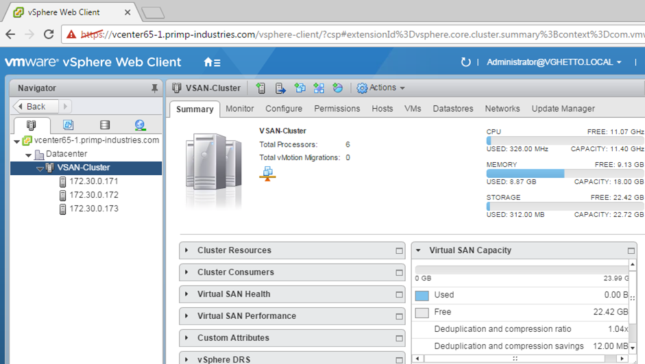
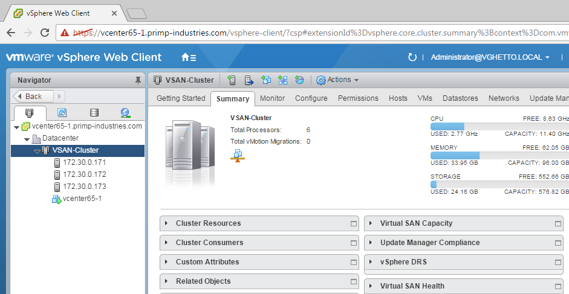

# vGhetto Automated vSphere Lab Deployment

## Table of Contents

<<<<<<< HEAD
* [Description](#description)
* [Changelog](#changelog)
=======
* [Description](#Description)
* [Changelog](#Changelog)
>>>>>>> d3f2e6a7e4d577ef769877cc87b7d06f5667ab91
* [Requirements](#requirements)
* [Supported Deployments](#supported-deployments)
* [Scripts](#scripts)
* [Configuration](#configuration)
* [Logging](#logging)
* [Verification](#verification)
* [Sample Execution](#sample-execution)

## Description

Automated deployment of a fully functional vSphere 6.0u2 or 6.5 environment that includes a set of Nested ESXi Virtual Appliance(s) configured w/vSAN as well as a vCenter Server Appliance (VCSA) using PowerCLI. For information, you can refer to this blog post [here](http://www.virtuallyghetto.com/2016/11/vghetto-automated-vsphere-lab-deployment-for-vsphere-6-0u2-vsphere-6-5.html) for more details.

## Changelog

* 11/22/16
  * Automatically handle Nested ESXi on vSAN

* 01/20/17
  * Resolved "Another task in progress" thanks to Jason M

* 02/12/17
  * Support for deploying to VC Target
  * Support for enabling SSH on VCSA
  * Added option to auto-create vApp Container for VMs

## Requirements
* 1 x Physical ESXi host or vCenter Server running at least vSphere 6.0u2
* Windows system
* [PowerCLI 6.5 R1](https://my.vmware.com/group/vmware/details?downloadGroup=PCLI650R1&productId=568)
* vCenter Server Appliance (VCSA) 6.0 or 6.5 extracted ISO
* Nested ESXi [6.0](http://www.virtuallyghetto.com/2015/12/deploying-nested-esxi-is-even-easier-now-with-the-esxi-virtual-appliance.html) or [6.5](http://www.virtuallyghetto.com/2016/11/esxi-6-5-virtual-appliance-is-now-available.html) Virtual Appliance OVA

## Supported Deployments

The scripts support deploying both a vSphere 6.0 Update 2 as well as vSphere 6.5 environment and there are two types of deployments for each:
* **Standard** - All VMs are deployed directly to the physical ESXi host
* **Self Managed** - Only the Nested ESXi VMs are deployed to physical ESXi host. The VCSA is then bootstrapped onto the first Nested ESXi VM

Here is a quick diagram to help illustrate the two deployment scenarios. The pESXi in gray is what you already have deployed which must be running at least ESXi 6.0 Update 2. The rest of the boxes is what the scripts will deploy. In the "Standard" deployment, three Nested ESXi VMs will be deployed to the pESXi host and configured with vSAN. The VCSA will also be deployed directly to the pESXi host and the vCenter Server will be configured to add the three Nested ESXi VMs into its inventory. This is a pretty straight forward and basic deployment, it should not surprise anyone. The "Self Managed" deployment is simliar, however the biggest difference is that rather than the VCSA being deployed directly to the pESXi host like the "Standard" deployment, it will actually be running within the Nested ESXi VM. The way that this deployment scenario works is that we will still deploy three Nested ESXi VM onto the pESXi host, however, the first Nested ESXi VM will be selected as a ["Bootstrap"](http://www.virtuallyghetto.com/2013/09/how-to-bootstrap-vcenter-server-onto_9.html) node which we will then construct a single-node vSAN to then deploy the VCSA. Once the vCenter Server is setup, we will then add the remainder Nested ESXi VMs into its inventory.



## Scripts
| Script Function | Script Download |
|-----------------|-----------------|
| vSphere 6.5 Standard Deployment | [vsphere-6.5-vghetto-standard-lab-deployment.ps1](vsphere-6.5-vghetto-standard-lab-deployment.ps1) |
| vSphere 6.0u2 Standard Deployment | [vsphere-6.0-vghetto-standard-lab-deployment.ps1](vsphere-6.0-vghetto-standard-lab-deployment.ps1) |
| vSphere 6.5 Self Managed Deployment | [vsphere-6.0-vghetto-self-manage-lab-deployment.ps1](vsphere-6.0-vghetto-self-manage-lab-deployment.ps1) |
| vSphere 6.0u2 Self Managed Deployment | [vsphere-6.5-vghetto-self-manage-lab-deployment.ps1](vsphere-6.5-vghetto-self-manage-lab-deployment.ps1) |

## Configuration

There are 7 sections at the top of the script which requires you to update the variables with your own environment configuration.

This section describes the credentials to your physical ESXi server or vCenter Server in which the vSphere lab environment will be deployed to:
```console
$VIServer = "himalaya.primp-industries.com"
$VIUsername = "root"
$VIPassword = "vmware123"
```

This section describes whether your deployment environment (destination) will be an ESXi host or a vCenter Server. You will need to specify either **ESXI** or **VCENTER** keyword:
```console
$DeploymentTarget = "ESXI"
```

This section defines the number of Nested ESXi VMs to deploy along with their associated IP Address(s). The names are merely the display name of the VMs when deployed. At a minimum, you should deploy at least three hosts, but you can always add additional hosts and the script will automatically take care of provisioning them correctly.
```console
$NestedESXiHostnameToIPs = @{
"vesxi65-1" = "172.30.0.171"
"vesxi65-2" = "172.30.0.172"
"vesxi65-3" = "172.30.0.173"
}
```

This section describes the resources allocated to each of the Nested ESXi VM(s). Depending on the deployment type, you may need to increase the resources. For Memory and Disk configuration, the unit is in GB.
```console
$NestedESXivCPU = "2"
$NestedESXivMEM = "6"
$NestedESXiCachingvDisk = "4"
$NestedESXiCapacityvDisk = "8"
```

This section describes the VCSA deployment configuration such as the VCSA deployment size, Networking & SSO configurations. If you have ever used the VCSA CLI Installer, these options should look familiar.
```console
$VCSADeploymentSize = "tiny"
$VCSADisplayName = "vcenter65-1"
$VCSAIPAddress = "172.30.0.170"
$VCSAHostname = "vcenter65-1.primp-industries.com" #Change to IP if you don't have valid DNS
$VCSAPrefix = "24"
$VCSASSODomainName = "vghetto.local"
$VCSASSOSiteName = "virtuallyGhetto"
$VCSASSOPassword = "VMware1!"
$VCSARootPassword = "VMware1!"
$VCSASSHEnable = "true"
```

This section describes the location as well as the generic networking settings applied to BOTH the Nested ESXi VM and VCSA.
```console
$VMNetwork = "dv-access333-dev"
$VMDatastore = "himalaya-local-SATA-dc3500-2"
$VMNetmask = "255.255.255.0"
$VMGateway = "172.30.0.1"
$VMDNS = "172.30.0.100"
$VMNTP = "pool.ntp.org"
$VMPassword = "vmware123"
$VMDomain = "primp-industries.com"
$VMSyslog = "172.30.0.170"
$VMSSH = "true"
$VMVMFS = "false"
$VMCluster = "Primp-Cluster"
```

This section describes the configuration of the new vCenter Server from the deployed VCSA.
```console
$NewVCDatacenterName = "Datacenter"
$NewVCVSANClusterName = "VSAN-Cluster"
```

Once you have saved your changes, you can now run the PowerCLI script as you normally would.

## Logging

There is additional verbose logging that outputs as a log file in your current working directory either **vsphere60-vghetto-lab-deployment.log** or **vsphere65-vghetto-lab-deployment.log** depending on the deployment you have selected.

## Verification

Once you have saved all your changes, you can then run the script. You will be provided with a summary of what will be deployed and you can verify that everything is correct before attempting the deployment. Below is a screenshot on what this would look like:


## Sample Executions

Here is an example of running a vSphere 6.5 "Standard" deployment:


Here is an example of running a vSphere 6.5 "Self Managed" deployment:



Here is an example of running a vSphere 6.0 "Standard" deployment:


If everything is succesful, you can now login to your new vCenter Server and you should either see the following for a **"Standard"** deployment:



or the following for **"Self Managed"** deployment:


